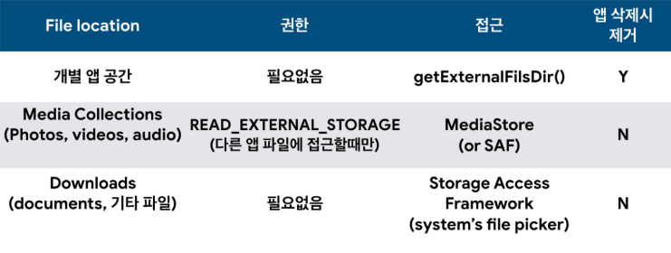

# Legacy Storage

### 외부 저장소(External Storage)

애플리케이션이 파일을 쓸 수 있는 공용 영역입니다.

다른앱들에 노출되지 않는 **Internal Storage**와 다르게 어떤경로로 저장된 파일인지 관계없이

모든파일에 대해서 접근이 가능한 Storage라고 생각하면 됩니다.


Android Pie 이전에서는 ```READ/WRITE STROAGE PERMISSION``` 만 갖고 있으면 누구든지 접근이 가능하기 때문에 보안/파일 관리에 있어서 한계를 가지고 있었다.


#### 파일관리 부분

가장 큰 문제는 어떤 파일이 어떤 앱에 속해 있는지 알 수 없다는 것이다. 만약 A라는 앱이 a파일을 **External Storage** 의 특정경로에 저장하고 나서 A라는 앱을 삭제하고 나면 그 누구도  a파일에 대한 책임을 갖고 있지 않기 때문에 반영구적으로 **External Storage** 에 저장되어 있을 것이다.


#### 보안 부분

 앞에서 언급한대로 ```READ/WRITE STORAGE PERMISSION```을 가지고 있는 경우 **Extrenal Storage** 에 있는 모든 파일을 열람할 수 있어서 앱에서 저장한 민감함 데이터들을 읽기/쓰기/수정이 가능하기 때문에 악의적인 목적을 가진 앱이 데이터를 수정 및 공격이 가능하게 됩니다. 

> 예를들어 악의적인 앱이 다운로드 폴더에 저장된 세금계산서 및 원천징수를 열람이 가능합니다.


# Scoped Storage 

Android 10 이상 버전에서 사용할 수 있는 새로운 모드입니다. 기존 외부저장소의 public file공간이 사라지게 되며 개별 앱공간이 샌드박스 형식으로 격리되어, 이제 다른앱의 파일에 접근할수 없게됩니다. MediaStore에도 추가 권한없이 사용이 가능하게 됩니다. MediaStore에 저장한 자신의 파일의 경우 READ/WRITE가 가능하게 되고 다른 앱이 저장된 파일까지 READ/WRITE하기 위해서는 ```READ/WRITE STRORAGE PERMISSION```이 필요합니다. 


기존에는 파일경로만 알고 있으면 파일을 READ/WRITE가 가능했지만 이제는 ```MediaStore/SAF```로만 접근이 가능하도록 수정되었습니다. 


자세히 살펴보면


### /sdcard 영역 접근 불가능

이제 앱에서 더이상 /sdcard이하의 영역에 직접 접근할수 없습니다. 그렇기 떄문에 ```Environment.getExternalStorageDirectory()```는 deprecated되었습니다. Myfiles, Solid File Explorer등은  새로운 권한을 받아야지 사용이 가능하게 되었습니다.


### 개별 앱 공간은 샌드박스 모델로 격리됨

 개별 앱의 공간은 이제 샌드박스 모델로 격리되어서 자기 자신의 파일을 READ/WRITE하는 것은  ```READ/WRITE STRORAGE PERMISSION``` 없이 가능하게 됩니다. 또한, 자신의 SandBox안에서는 파일의 절대 경로를 사용할 수 있으며 다른 앱에 전달하기 위해서는 ContentUri를 만들고 접근권한을 허용하는 방안을 사용해야 합니다.


### 공용저장 공간의 변경

 파일을 저장할때 만약 앱이 지워져도 파일이 존재해야 한다면 (ex: 사진, 동영상) MediaStore를 통하여 파일을 저장해야 합니다. 또한 기존에 존재하던 사진, 동영상 그리고 음악에 이어서 Download컬렉션이 추가되었습니다. 


### 파일 접근 권한 정리



개별 앱 공간과 Download의 경우에는 권한이 필요가 없고 MediaStore같은 경우에도 권한이 필요한 경우는 다른 앱 파일에 접근할 때만 필요하다고 볼 수 있다.  MediaStore에서 Audio, Video, Image의 경우 ```READ_EXTERNAL_STORAGE```가 없다면 자기가 추가한 파일들만 볼 수 있다. 그리고 만약 쓰기 권한을 요청한다고 하여도 오직 ```READ_EXTERNAL_STORAGE```만 적용되게 된다.


### Downalod 컬렉션

Download에 저장된 파일들은 **자신이 생성한 파일을 제외**하고는 시스템 파일 탐색기를 이용해서 사용자가 명시적으로 선택한 경우에만 접근이 가능합니다. 다운로드 컬렉션의 경우 Non-media file을 위해 새롭게 디자인된 곳이다. 이 곳에서는 non-media file 쓰기/읽기가 가능하다. 하지만 다른 Collection들과는 다르게 ```READ_STORAGE_PERMISSION```이 있다고 해서 다른 앱이 올린 files들을 볼 수 가 없다.

> 이를 위해 Android 10에서는 SAF(Systeam Access Framework)가 재단장 되었다.


### Media Location 권한 강화

 ```READ_EXTERNAL_STORAGE```를 통해 Image나 Video를 갖고 올 수 있다고 해서 그 파일에 저장된 위치 metadata를 가지고 올 수 있는 것이 아니다. 이제 ```ACCESS_MEDIA_LOCATION```권한을 유저에게 동의를 받아야지만 위치  metadata가 포함된 파일을 받을 수 있다.


### 미디어 수정 및 삭제

 자기 자신이 만든 media의 경우 수정 및 삭제가 자유롭게 일어나게 되지만 다른앱이 만든 미디어의 경우에는 수정 및 삭제를 하기 위해서는 유저에게 특정 UI를 통하여 동의를 받아야 합니다.  여러 미디어를 bulk 수정 및 삭제가 가능한 UI 또한 추가되었습니다.


### Storage Access Framework

 Non-media 파일의 경우 System Picker를 사용해서 권한을 얻어야한다. 또한 이제부터는 공유 엑세스 포인트(구 external storage) 그리고 다른 앱 폴더 등등 민감한 디렉토리에 대한 권한을 얻을 수 없도록 수정됩니다. 또한 

```ACTION_OPEN_DOCUMENT```를 사용하여 단일 파일을 open할 떄 쓸 수 있고 ```ACTION_OPEN_DOCUMENT_TREE```를 사용하여 단일 폴더를 선택할 때 쓸 수 있습니다.

하지만 이 때도 디바이스가 rebooting되게 되면 퍼미션을 잃게 되기 때문에 

```kotlin
takePernsistableUriPermission(uri)
```

를 사용하여서 엑세스를 계속 유지하도록 할 수 있습니다. 하지만 이 역시 수정 or 삭제 된다면 permission이 회수되므로 언제나 Permission을 확인해야 합니다.


### Scoped Storage 적용

Android Q이상(Android 10)이상에서는 바로 사용할 수 있지만 개발자들의 적용을 위하여 한시적으로 legacy storage를 사용할 수 있도록 수정되어 있었습니다.  

```xml
<application android:requestLegacyExternalStorage = "true"/>
```

하지만 이제 Android 11을 target으로 SDK version을 올리게 된다면 꼼짝없이 Scoped Storage를 적용해야 합니다.  


### Android 11 Preview 사항

현재  Android 11 Preview에서는 다양한 ScopedStorage 관련 변경사항이 공개되고 있기 때문에 공식 홈페이지를 통해서 확인하는것이 가장 빨라 보입니다. [링크](https://developer.android.com/preview/privacy/storage)

현재까지 지원되는 목록은 다음과 같습니다


#### Android 10과 호환성 유지

```xml
<application android:requestLegacyExternalStorage = "true"/>
```

현재 앱이 targetsdkVersion = 29이면 legacyExternalStorage를 사용할수 있습니다. 


#### Scoped Storage Test

앱의 타겟 SDK 버전 및 Manifest Flag 값과 관계없이 앱의 ScopedStorage를 사용설정 할려면 다음 앱 호환성 플래그를 사용설정하세요.

* [`DEFAULT_SCOPED_STORAGE`](https://developer.android.com/preview/test-changes#default_scoped_storage)(기본적으로 모든 앱에 사용 설정됨)
* [`FORCE_ENABLE_SCOPED_STORAGE`](https://developer.android.com/preview/test-changes#force_enable_scoped_storage)(기본적으로 모든 앱에 사용 중지됨)